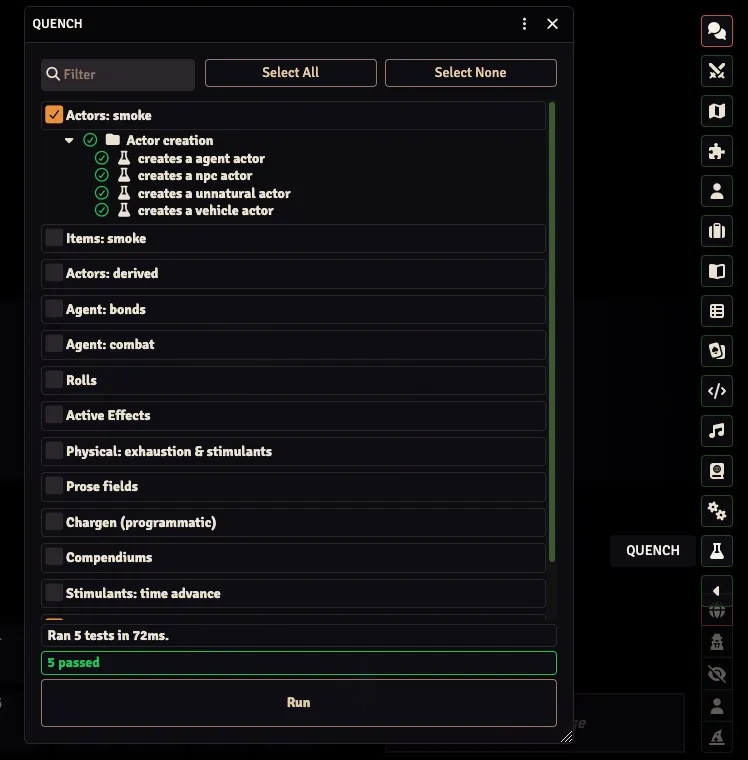
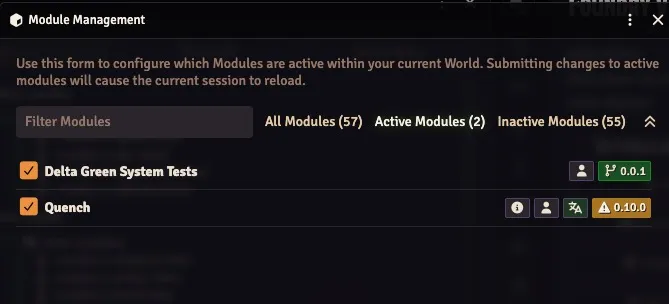
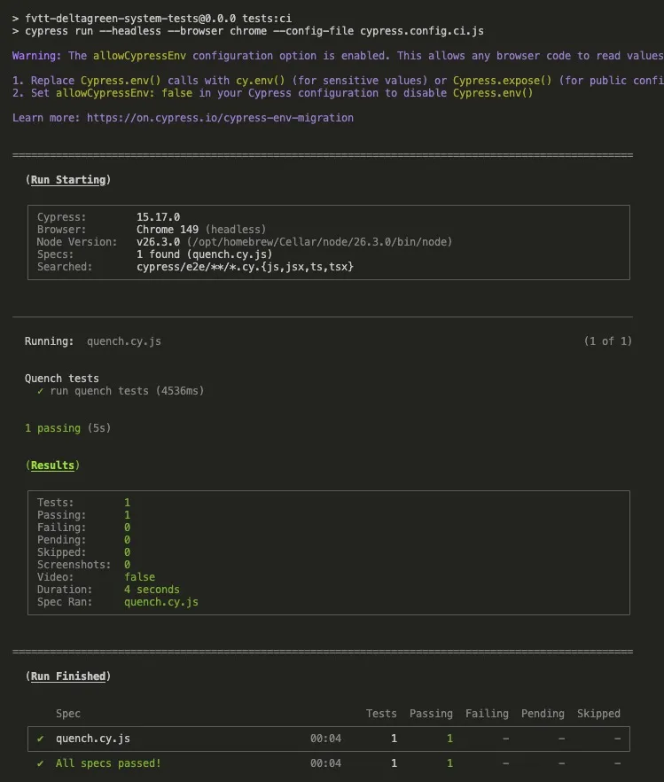
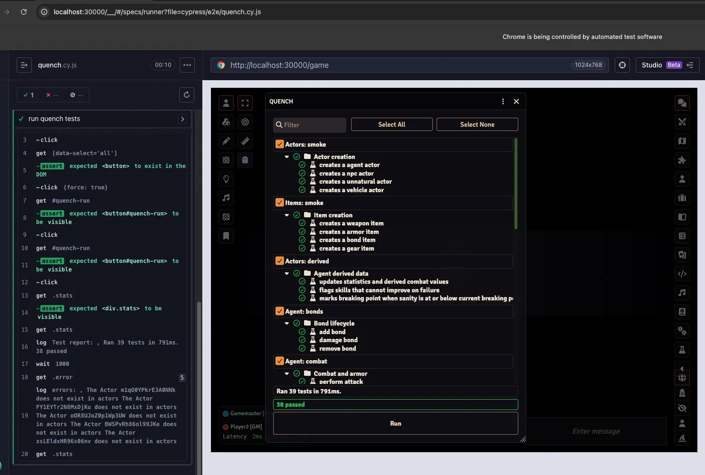

# Delta Green System Tests Module

Note: this is a testing module. I don't want to spend my life writing tests, so I have llms do as much as possible.
Take errors thown with that in mind.

for running against [The Delta Green system ](https://github.com/deltagreen-foundryvtt/delta-green-foundry-vtt-system)

## Setup
- Requires **Node.js >= 20.19**
- Run `pnpm install`
- Copy [`fvtt.config.example copy.js`](./fvtt.config.example%20copy.js) to `fvtt.config.js` and set `userDataPath` / `baseURL` for your Foundry install
   - a module needs to be generated from this code and added to foundry.
   - Match `baseURL` in `fvtt.config.js` to your Foundry URL for Cypress
- Run `pnpm run build` or `pnpm run watch`
   - this will buld the module, so it'll appear in your
- Run Foundry with the **Delta Green** system (compendium packs must be available)
- Install the [Quench](https://foundryvtt.com/packages/quench) module from the foundry store
- Create a DG world, enable **Quench** and **Delta Green System Tests**

You should now be able to run the quench tests from the sidebar:

Enabled modules in your DG world should look like this:
Quench and Delta Green System Tests enabled in the Foundry module list

I'm too lazy to reload and go click that `Quench` button myself, so I have Cypress do it:
Do note that *your foundry world has to be running* for these tests to pass...

running `pnpm run tests:ci`:

running `pnpm run tests`:

## Quench batches

| Batch ID | Topic |
|----------|--------|
| `deltagreen.actors.smoke` | Actor types |
| `deltagreen.items.smoke` | Item types |
| `deltagreen.actors.derived` | Derived agent data |
| `deltagreen.agent.bonds` | Add / damage / remove bonds |
| `deltagreen.agent.combat` | Attacks, damage, armor (compendium gear) |
| `deltagreen.rolls` | Skill, weapon, modified, luck rolls |
| `deltagreen.activeEffects` | Roll targets, max HP, motivation AE, agent sheet `canManageEffects` |
| `deltagreen.physical` | Exhaustion, rest, stimulants, repeat-dose WP loss (`stimulantDosesSinceRest`) |
| `deltagreen.prose` | HTML / ProseMirror persistence |
| `deltagreen.chargen` | Programmatic character creation commit |
| `deltagreen.chargen.flow` | Profession assignment via compendium + commit path |
| `deltagreen.compendiums` | Firearms, armor, unarmed, professions packs |
| `deltagreen.sheets.persistence` | Hybrid actor/item sheet description round-trips |
| `deltagreen.items.functional` | Per-item behavior (all 8 item types) |
| `deltagreen.sanity.automation` | SAN adaptation tick/clear/chat automation |
| `deltagreen.sanity.guards` | Multi-user dedup guards (`userId` checks) |
| `deltagreen.stimulants.time` | Stimulant expiry after time advance (**active GM only**) |
| `deltagreen.api` | `game.deltagreen` surface |
| `deltagreen.regressions` | Regression guards for closed issues (NPC/unnatural fields, skills, token name, BP reset, rolls, ritual SAN, stat parser AP) |
| `deltagreen.known-bugs` | Open system bugs expected to fail until fixed (stat parser Unarmed shorthand) |

**Notes:** Compendium tests require system packs (`deltagreen.firearms`, `deltagreen.armor`, `deltagreen.hand-to-hand-weapons`, `deltagreen.professions`). Binary packs are gitignored in the system repo — your local Foundry install must have them loaded. The stimulant time batch skips for non-GM users; calendar modules are not required for the basic `game.time.advance` check.

**Multi-user:** Quench runs in a single browser session. The `deltagreen.sanity.guards` batch verifies `userId !== game.user.id` dedup logic programmatically. True concurrent GM + player socket timing still requires two connected clients (manual).

**Sheet UI:** Sheet persistence batches use programmatic `update` + render/close/reopen (not ProseMirror keystrokes). Real drag-and-drop profession assignment dialogs are covered via stubbed commit paths in `deltagreen.chargen.flow`.

Issues that are poor Quench fits (#392, #393, #357, #396) are listed in [docs/QUENCH_UI_DEFERRED.md](./docs/QUENCH_UI_DEFERRED.md).

## Running tests
- In-world: **Quench** sidebar → run selected batches
- Cypress E2E (interactive): `pnpm run tests` — opens Cypress against `baseURL` in `fvtt.config.js`
- Cypress E2E (headless / CI): `pnpm run tests:ci` — runs the full Quench suite via the UI (Foundry must be running with world `simple_requests` and modules enabled)

Set `FOUNDRY_ADMIN_KEY`, `FOUNDRY_PASSWORD`, or `ADMIN_PASSWORD` for setup-screen auth when Cypress hits `/auth`.
